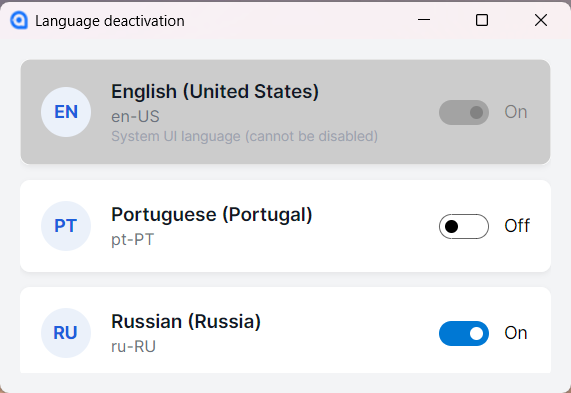

 

# Language Deactivation

Утилита для управления списком активных языков ввода в Windows.

# Назначение

Для тех, у кого установлены специфические языки ввода, используемые редко (например, для периодического набора текста, проверки правописания или тестирования). При этом иногда необходимо их скрыть из стандартного переключения раскладки (`Win` + `Пробел`) во время обычной работы.

Программа позволяет выполнить «мягкую деактивацию» — языковой пакет остается в системе, но метод ввода удаляется из списка активных у текущего пользователя.

# Техническая информация

Приложение работает как оболочка над командой Windows PowerShell `Set-WinUserLanguageList`.

**Операционная система:** Windows 10/11 (x64)
**Фреймворк:** dotnet 10
**Интерфейс:** Avalonia
